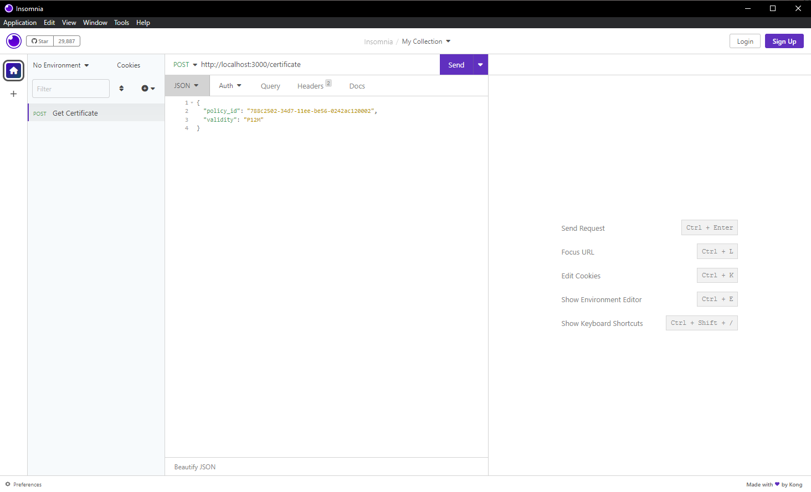
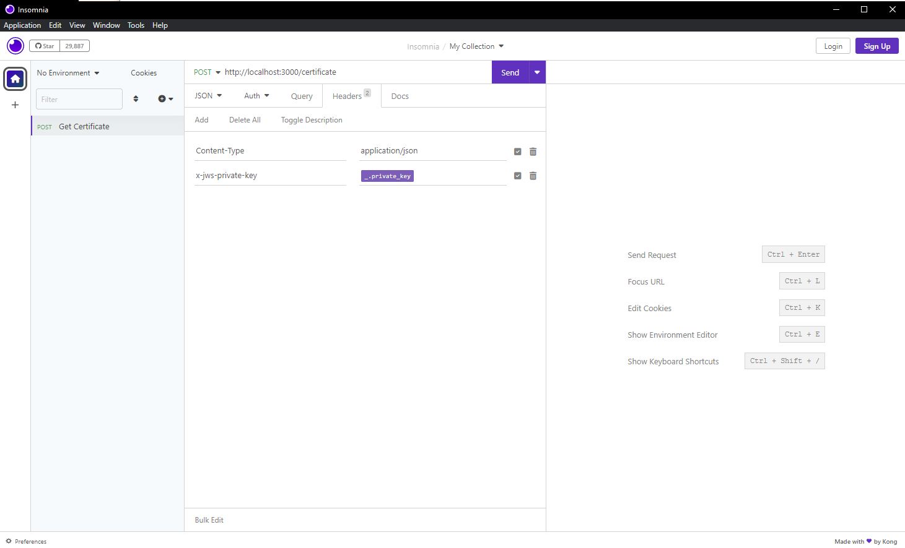

# Sign JWS payload
Convert request body into JWS using a private key.

## Installation

### From Insomnia Plugin Hub

1. Navigate to [https://insomnia.rest/plugins/insomnia-plugin-sign-jws-payload](https://insomnia.rest/plugins/insomnia-plugin-sign-jws-payload)
2. Click _Install Plugin_
3. Click _Open_
4. Once opened, click _Install_

### From the Insomnia App

1. Go to _Application_ > _Preferences_ **or** click the cog icon (⚙️)
2. Navigate to the _Plugins_ tab
3. Enter `insomnia-plugin-sign-jws-payload`
4. Click _Install_

### Manual Install

1. Using a terminal, `cd` into your Insomnia plugins folder - [See Insomnia Docs](https://docs.insomnia.rest/insomnia/introduction-to-plugins)
2. Run `git clone https://github.com/cobe529/insomnia-plugin-sign-jws-payload.git`

### Usage

- In the requests, the private key that will be used for signing shall be added in a header named `x-jws-private-key`.
- All line breaks in the private key shall be converted into '\n'. You can also add the private key in environment variables.
- The JSON payload will be signed using ES256 algorithm.
- The `x-jws-private-key` header will be removed before the API is sent.
- The body should look like:
    

        
    

- The header should look like:
    

        
    

